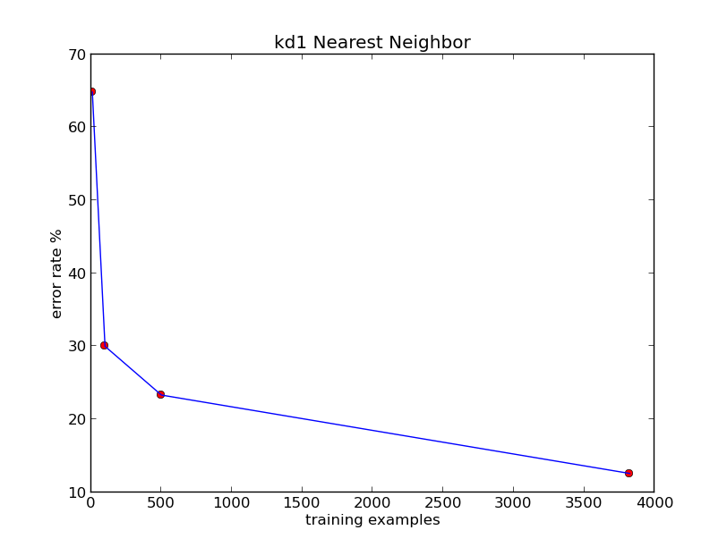

#Nearest Neighbor

##About:

* name: near_n
* function: classifies images
* input: bitmap image 01, 10
* output: classification 0 1 2 3 4 5 6 7 8 9

##Info:
Pattern classification is a part of the field of Machine Learning. The goal of classification is to __partition__ or modularize the space of possible choices into distinct classes of objects based on __features__ about the data. 

* Classifiers: 
* __0 1 2 3 4 5 6 7 8 9__

The classification in this problem is related to images of numbers. The goal of the program is to identify numbers based on the their bitmap representations. 

To accomplish the goal of image classification a nearest neighbor approach was taken. Nearest neighbors is a simple and fast method for identifying and classifying data.

The data structure used to perform nearest neighbor search is a __k-dimensional tree__. Kd-trees provide a fast search for classification. A balanced kd-tree has a time complexity of __log(n)__.

The kd-tree is built with the __medians__ of the the data set after __sorting__. The data is then inserted left or right of the tree based on the ith element in the data vector.

The reason the kd-tree is so powerful is because of its ability to mimic the effects of __binary search__. In binary search the numbers are first sorted then split into orders of left and right because of the __global ordering__ of all the data. Half of the data is to the left of the center of the sorted data and the other half is to the right. Therefore, when you search from the center you are eliminating half of the data set each center partition you make, which is a similar effect in kd-tree search.   

Do to the large dimensionality of bit images, the images were __transformed__ to avoid high dimensional search.

* Transform: 64x64 -> 8x8 
* input: 64x64 bitmap [feature space: 4096 dimensional]
* output: 8x8  bitmap [feature space: 64 dimensional]

Large dimensions within machine learning is a common problem known as the __curse of dimensionality__ because space grows _exponentially_ for every dimension added. The data was transformed to a more manageable size. 

The nearest neighbors can be found by using a variety of distance measuring metrics. The metrics used in this program are Euclidean distance and Manhattan distance.

The data set for this project can be found [here](http://archive.ics.uci.edu/ml/datasets/Optical+Recognition+of+Handwritten+Digits).

##Results: 

|       |Error|Test  |Train|
|-------|-----|------|-----|
|kd-1   | 12% | 1797 | 3823|

###Run:
* `cd /dir/of/near_n`
* `python near_n.py ./img-data/*`

##Dependencies:   
`pip install matplotlib`

##TODO:
* Principle Component Analysis (PCA)
* Pygame integration
* KD-Tree in data base 