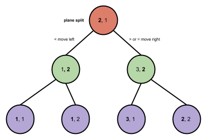

##Nearest Neighbor

###About:
#####name:
near_n
#####function:
This is a program that classifies images. 

#####input:
bitmap of image
#####output:
classification of image

###Info:
Pattern classification is a part of the field of Machine Learning. The goal of classification is to partition(modularize) the space of possible choices into distinct classes of objects based on features(variables) about data. 

The classification in this problem is related to images of numbers(0123456789). The goal of the program is to identify numbers based on the their bitmap representations. 

To accomplish the goal of image classification a nearest neighbor approach was taken. Nearest neighbors is a simple and fast method for identifying and classifying data.

The data structure used to perform nearest neighbor search is a k-dimensional tree(kd-tree). Kd-trees provide a fast search for classification. A balanced kd-tree has a time complexity of log(n).

The kd-tree is built with the medians of the the data set after sorting. The data is then inserted left or right of the tree based on the ith element in vector(plane) of data.

The reason the kd-tree is so powerful is because of its ability to mimic the effects of binary search. In binary search the numbers are first sorted then split into orders of left and right(< or >) because of the global ordering of all the data. Half of the data is to the left of the center of the sorted data and the other half is to the right. Therefore, when you search from the center you are eliminating half of the data set each center partition you make, which is a similar effect in kd-tree search.   

Do to the large dimensionality of bit images(64x64=4096), the images were transformed to avoid high dimensional search. Large dimensions within machine learning is a common problem(the curse of dimensionality) because space grows exponentially for every dimension added. The data was transformed to a lower dimension(8x8=64). 

The nearest neighbors can be found by using a variety of distance measuring metrics. The metrics used in this program are Euclidean distance and Manhattan distance.

The data set for this project can be found at:
http://archive.ics.uci.edu/ml/datasets/Optical+Recognition+of+Handwritten+Digits

###Results: 
####type: 
kd-1
####error rate: 
12%

###Run:
`cd /dir/of/near_n`

`python near_n.py ./img-data/*`

###Dependencies:   
matplotlib
`pip install matplotlib`

###TODO:
perform Principle Component Analysis (PCA)
integrate with pygame
place kd-tree in data base 